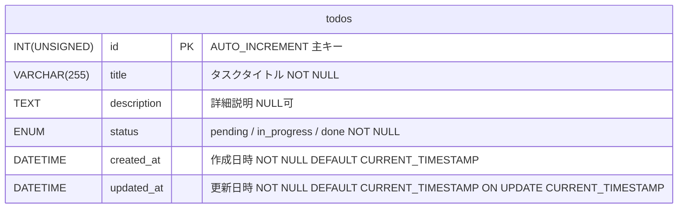
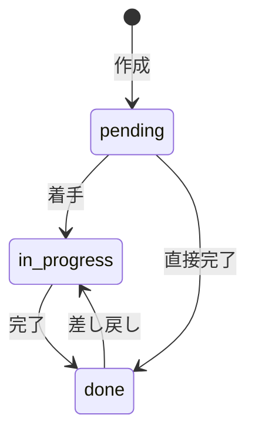

# ER図 - laminas-todo-app

## テーブル定義

## フィールド詳細

| フィールド | 型 | NULL | デフォルト | 説明 |
|---|---|---|---|---|
| id | INT UNSIGNED | NO | AUTO_INCREMENT | 主キー |
| title | VARCHAR(255) | NO | - | タスクタイトル |
| description | TEXT | YES | NULL | タスクの詳細説明 |
| status | ENUM('pending','in_progress','done') | NO | 'pending' | 進捗ステータス |
| created_at | DATETIME | NO | CURRENT_TIMESTAMP | 作成日時（自動設定） |
| updated_at | DATETIME | NO | CURRENT_TIMESTAMP | 更新日時（自動更新） |

## ステータス遷移

